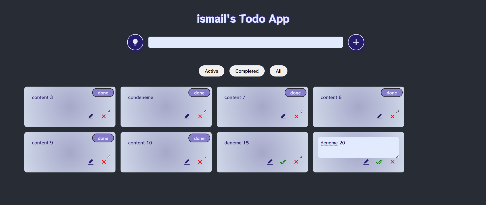
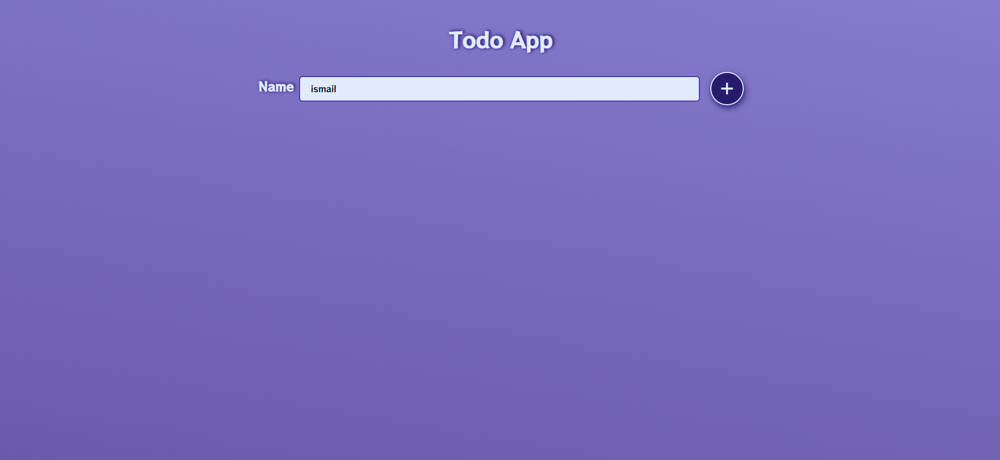
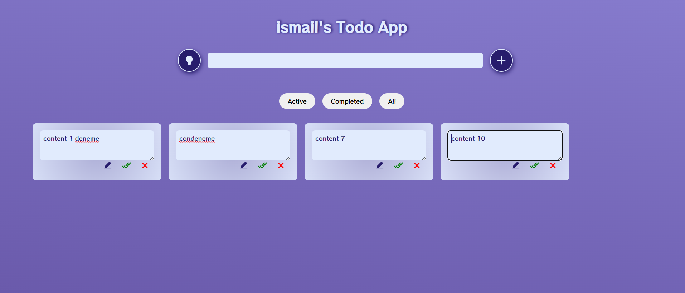
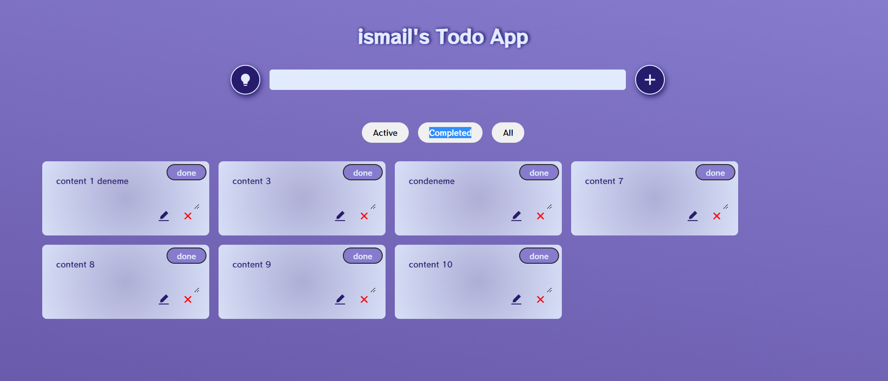
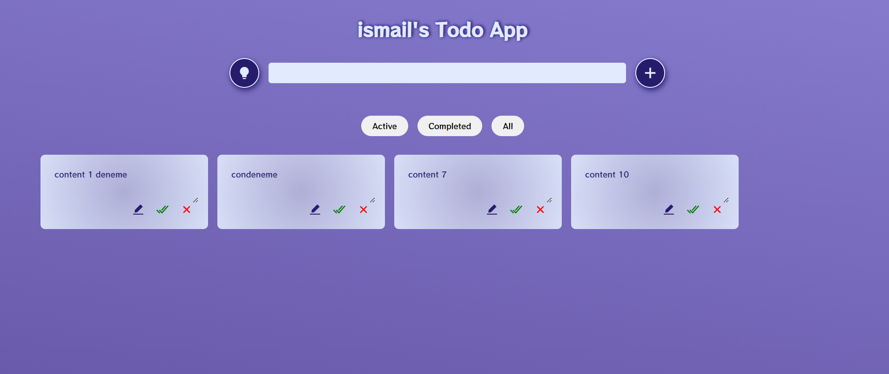
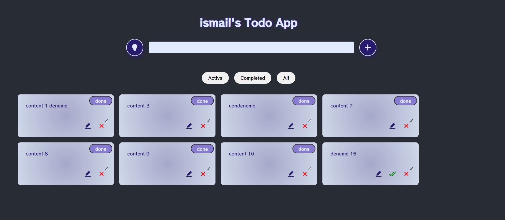

# Todo App Using API

Project Image : 

Name Page :

Edit Page :

Completed Page :

All Todos :

Dark Mode : 

-Todo API using in this project.

-All CRUD operations took place through the API you created.
